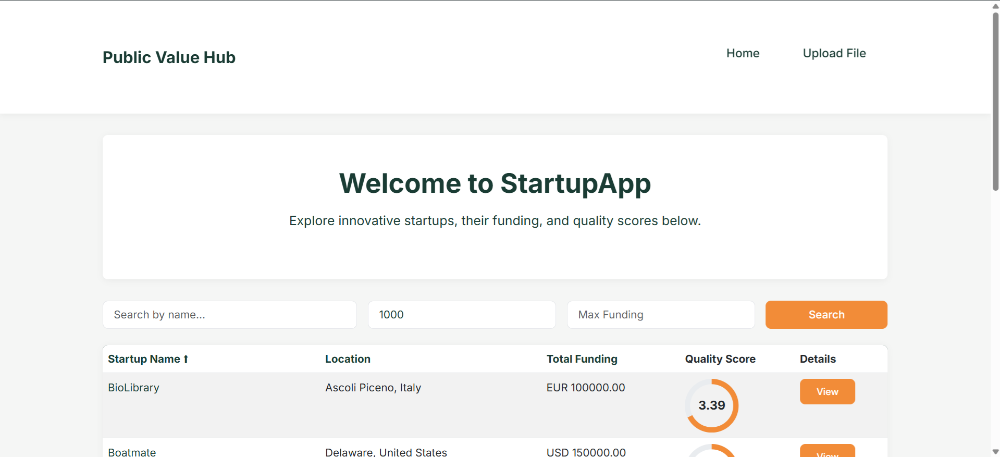
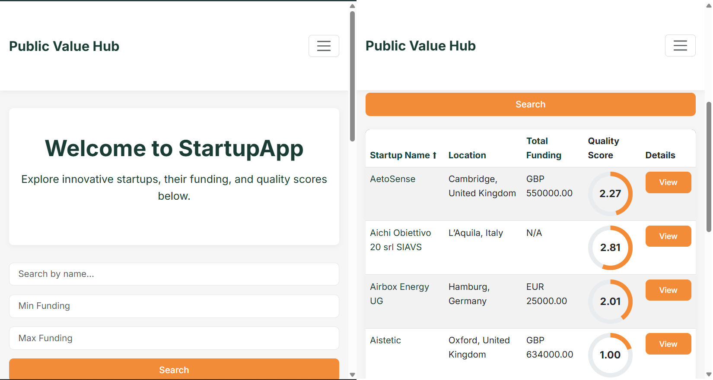
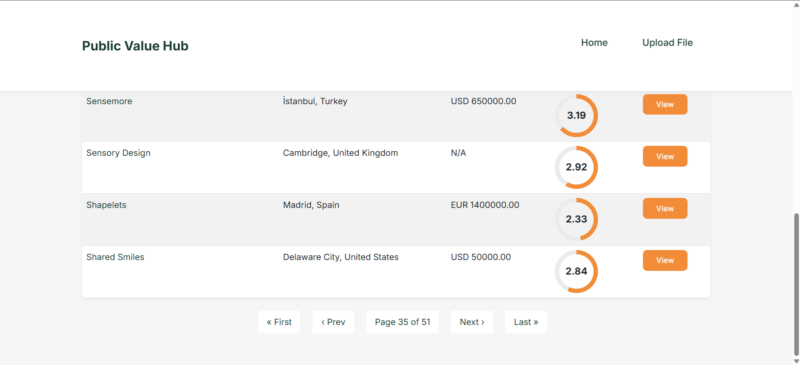

# HubValue - Startup Evaluation Platform

## Overview
A responsive web-based startup application management system developed using Django for the backend and Bootstrap for the frontend UI, including a sample administrative interface for managing data.

### App Screenshot


#### Mobile Interface


#### Pagination


## Installation & Setup

### Prerequisites
- Python 3.12+
- Git
- Conda (recommended) or virtualenv

### Clone the Repository
```sh
git clone https://github.com/YoussefOuarrak/startupapp
cd startupapp
```

### Option 1: Setup with Conda (Recommended)
```sh
# Create and activate virtual environment
conda create -n hubvalue python=3.12
conda activate hubvalue

# Install dependencies
pip install -r requirements.txt
```

### Option 2: Setup with virtualenv
```sh
# Create and activate virtual environment
python -m venv venv
source venv/bin/activate  # On Windows: venv\Scripts\activate

# Install dependencies
pip install -r requirements.txt
```

### Configure Django Project
```sh
# Run migrations
python manage.py migrate

# Start development server
python manage.py runserver
```

Visit `http://127.0.0.1:8000/` to see the application running.


## Admin Panel
From the admin Panel you can manage:
- User accounts (create, modify, delete)
- Directly view and edit database records

### Accessing the Admin Panel

1. Ensure you've created a superuser account using the command:
   ```sh
   python manage.py createsuperuser
   ```

2. Start the Django development server:
   ```sh
   python manage.py runserver
   ```

3. Visit `http://127.0.0.1:8000/admin` in your browser

4. Log in with your superuser credentials

Administrators can use this interface to oversee all aspects of the platform without requiring direct database access or code changes.


## Features

**Excel File Upload 📤**
-	Accept Excel files containing startup application data
-	Provide clear feedback on upload success/failure
-   Handle basic file validation

**Data Processing 🔄**
-   Parse Excel data into appropriate database models
-   Handle data cleaning and validation

**Startup Overview 📊**
-   Paginated table view of startups
-   Essential startup information columns
-   Optional: Sortable columns
-   Quality score visualization for each startup (see 5.)

**Startup Details 📋**
-   Detailed view accessed by clicking table rows
-   Comprehensive startup information display
-   Professional layout and design

**Quality Scoring ⭐**
-   Algorithm to evaluate completeness of startup application data
-   Visual representation of quality score

**Admin Panel**: for complete database and user management 


## Tech Stack
- **Backend:** Django (Python 3.12) with SQLite database
- **Frontend:** Bootstrap CSS for responsive UI
- **Libraries:** OpenPyxl (Excel file processing), PyParsing, Django JSONField


## Project Structure
```
startupapp/
├── media/              # User uploaded files
│   └── uploads/        # Contains Excel files for startup evaluation
├── startupapp/         # Django project core
│   ├── static/         # Static assets
│   │   └── style.css   # Main stylesheet
│   ├── templates/      # HTML templates
│   │   ├── startups/   # Startup-related templates
│   │   ├── base.html   # Base template with common elements
│   │   ├── upload_success.html  # Upload confirmation page
│   │   └── upload.html # File upload interface
│   ├── admin.py        # Admin interface configuration
│   ├── forms.py        # Form definitions
│   ├── models.py       # Database models
│   ├── settings.py     # Project settings
│   ├── urls.py         # URL routing
│   └── views.py        # View functions
├── db.sqlite3          # SQLite database
├── manage.py           # Django management script
├── README.md           # Project documentation
└── requirements.txt    # Project dependencies
```

## Key Design Decisions

### JSONFields with SQLite
- **Scalability** – JSONFields allow dynamic fields without requiring database migrations
- **Efficient Storage** – Avoids unnecessary NULL columns for startups with varying numbers of founders, social media links, or 

### File Upload System
- Excel file processing for standardized data import
- Support for multiple file formats and structures
- Validation and data cleaning during import

## Application Flow
1. Users upload startup data via Excel files
2. System processes and validates the data
3. Startups are stored in the database with their evaluation metrics
4. Users can view, search, and analyze startup information
5. Administrators can manage all data through the admin panel