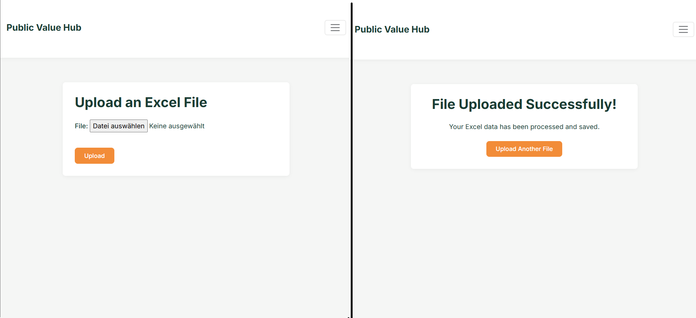
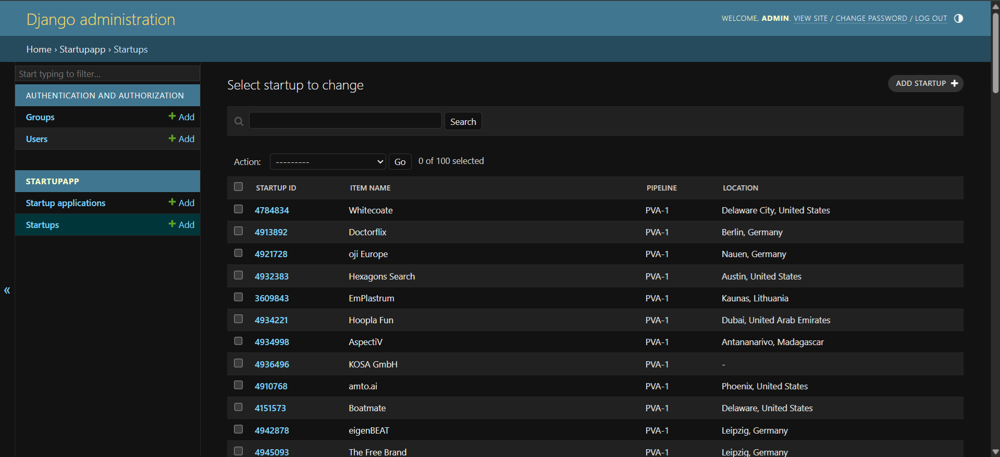
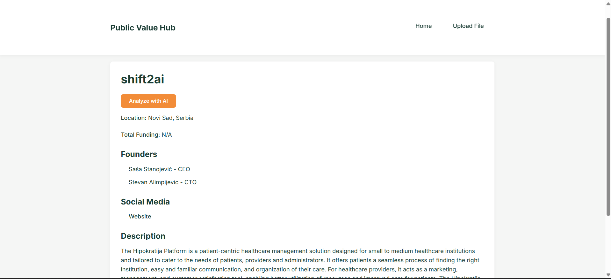
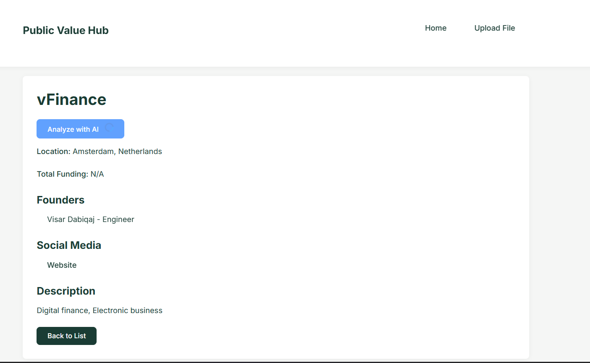
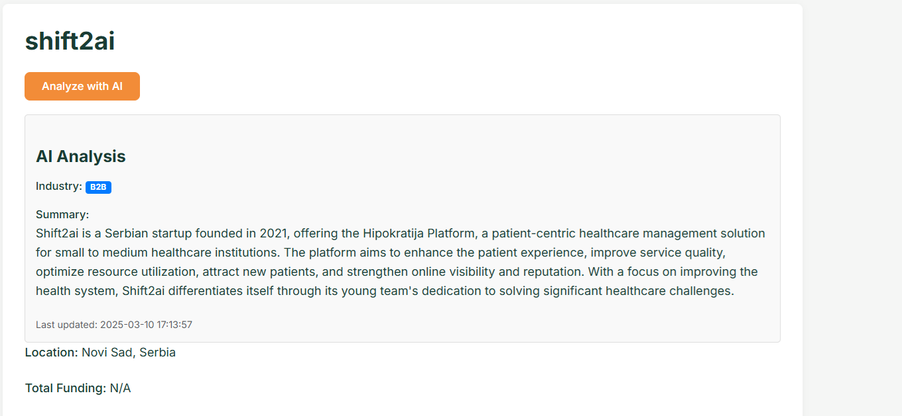

# HubValue - Startup Evaluation Platform

## Overview
A responsive web-based startup application management system developed using Django for the backend and Bootstrap for the frontend UI, including a sample administrative interface for managing data.

### App Screenshot


#### Mobile Interface


#### Pagination


#### Uplaod xls File


## Installation & Setup

### Prerequisites
- Python 3.12+
- Git (to clone the project)
- Conda (recommended) or virtualenv

### Clone the Repository
```sh
git clone https://github.com/YoussefOuarrak/startupapp
cd startupapp
```

### Option 1: Setup with Conda (Recommended)
```sh
# Create and activate virtual environment
conda create -n hubvalue python=3.12
conda activate hubvalue

# Install dependencies
pip install -r requirements.txt
```

### Option 2: Setup with virtualenv
```sh
# Create and activate virtual environment
python -m venv venv
source venv/bin/activate  # On Windows: venv\Scripts\activate

# Install dependencies
pip install -r requirements.txt
```

### Configure Django Project
```sh

# Run migrations
python manage.py migrate

# Start development server
python manage.py runserver
```

Visit `http://127.0.0.1:8000/` to see the application running.


## Admin Panel
From the admin Panel you can manage:
- User accounts (create, modify, delete)
- Directly view and edit database records

#### Admin Panel screen



### Accessing the Admin Panel

1. Ensure you've created a superuser account using the command:
   ```sh
   python manage.py createsuperuser
   ```

2. Start the Django development server:
   ```sh
   python manage.py runserver
   ```

3. Visit `http://127.0.0.1:8000/admin` in your browser

4. Log in with your superuser credentials

Administrators can use this interface to oversee all aspects of the platform without requiring direct database access or code changes.


## Features

**Excel File Upload 📤**
-	Accept Excel files containing startup application data
-	Provide clear feedback on upload success/failure
-   Handle basic file validation

**Data Processing 🔄**
-   Parse Excel data into appropriate database models
-   Handle data cleaning and validation

**Startup Overview 📊**
-   Paginated table view of startups
-   Essential startup information columns
-   Optional: Sortable columns
-   Quality score visualization for each startup (see 5.)

**Startup Details 📋**
-   Detailed view accessed by clicking table rows
-   Comprehensive startup information display
-   Professional layout and design

**Quality Scoring ⭐**
-   Algorithm to evaluate completeness of startup application data
-   Visual representation of quality score

**Admin Panel**: for complete database and user management 

**AI-Enhanced Startup Analysis** 


## Tech Stack
- **Backend:** Django (Python 3.12) with SQLite database
- **Frontend:**  Bootstrap CSS for responsive UI, JavaScript (AJAX)
- **Libraries:** OpenPyxl (Excel file processing), PyParsing, Django JSONField
- **AI Service**: OpenAI API (GPT-3.5-turbo)


## Project Structure
```
startupapp/
├── media/              # User uploaded files
│   └── uploads/        # Contains Excel files for startup evaluation
├── startupapp/         # Django project core
│   ├── static/         # Static assets
│   │   └── style.css   # Main stylesheet
│   ├── templates/      # HTML templates
│   │   ├── startups/   # Startup-related templates
│   │   ├── base.html   # Base template with common elements
│   │   ├── upload_success.html  # Upload confirmation page
│   │   └── upload.html # File upload interface
│   ├── admin.py        # Admin interface configuration
│   ├── forms.py        # Form definitions
│   ├── models.py       # Database models
│   ├── settings.py     # Project settings
│   ├── urls.py         # URL routing
│   ├── ai_services.py  # Ai Service
│   └── views.py        # View functions
├── db.sqlite3          # SQLite database
├── manage.py           # Django management script
├── README.md           # Project documentation
└── requirements.txt    # Project dependencies
```

## Key Design Decisions

### JSONFields with SQLite
- **Scalability** – JSONFields allow dynamic fields without requiring database migrations
- **Efficient Storage** – Avoids unnecessary NULL columns for startups with varying numbers of founders, social media links, or 

### File Upload System
- Excel file processing for standardized data import
- Support for multiple file formats and structures
- Validation and data cleaning during import

## Application Flow
1. Users upload startup data via Excel files
2. System processes and validates the data
3. Startups are stored in the database with their evaluation metrics
4. Users can view, search, and analyze startup information
5. Administrators can manage all data through the admin panel


## Ai Enhancement 


1. AI Integration Button on startup detail pages
2. Startup Summary Generation using OpenAI's GPT-3.5-turbo
3. Industry Classification for startups

## Implementation Approach

### 1. Database Model for AI Analysis

Added a new `StartupAIAnalysis` model in `models.py` to store and cache AI-generated results:

```python
class StartupAIAnalysis(models.Model):
    startup = models.OneToOneField('Startup', on_delete=models.CASCADE, related_name='ai_analysis')
    summary = models.TextField(blank=True, null=True)
    industry_classification = models.CharField(max_length=50, blank=True, null=True)
    last_updated = models.DateTimeField(default=timezone.now)
    def __str__(self):
        return f"AI Analysis for {self.startup.item_name}"
```

### 2. AI Service Implementation

Created a dedicated `AIService` class in `ai_services.py` to handle communication with the OpenAI API:

```python
class AIService:
    def __init__(self):
        # Configure OpenAI API key
        openai.api_key = settings.OPENAI_API_KEY

    def generate_startup_summary(self, startup_data):
        # Implementation that calls OpenAI API for summary generation
        
    def classify_industry(self, startup_data):
        # Implementation that calls OpenAI API for industry classification
```

### 3. Backend API Endpoint

Added an API endpoint in `views.py` to handle AI analysis requests:

```python
@require_POST
def analyze_startup_with_ai(request, startup_id):
    # Retrieves startup data
    # Calls AI service
    # Stores results in database
    # Returns JSON response
```

### 4. Frontend Integration

Enhanced the startup detail template (`startup_detail.html`) with:
- "Analyze with AI" button
- Loading state indicator
- Results display section with appropriate styling
- JavaScript for AJAX communication with the backend

### 5. Styling and Visual Feedback

Added CSS for:
- Color-coded industry classification badges
- Loading spinner animation
- Formatted AI analysis section

## Configuration Requirements

### OpenAI API Key Setup

The application requires an OpenAI API key to function properly. Follow these steps to configure it:

1. **Get an API key** from [OpenAI](https://platform.openai.com/)
2. **Add the key to your environment variables**:

```bash
# For Windows (Command Prompt)
set OPENAI_API_KEY=your-api-key-here

# For Windows (PowerShell)
$env:OPENAI_API_KEY="your-api-key-here"

# For Linux/macOS
export OPENAI_API_KEY=your-api-key-here
```

3. **Update Django settings** to use the environment variable:

```python
# In settings.py
import os

OPENAI_API_KEY = os.environ.get('OPENAI_API_KEY')
```

## Feature Details

### AI Integration Button

- Prominently placed on the startup detail page
- Shows loading state during API request
- Disables during processing to prevent multiple requests


#### Before and While processing






### Startup Summary Generation

- Creates a concise 3-4 sentence summary based on available startup data
- Uses context from multiple data fields (description, tagline, markets, etc.)
- Displays in a formatted section on the detail page

#### After processing



### Industry Classification

- Classifies startups into one of the required verticals:
  - B2B (Business to Business)
  - B2C (Business to Consumer)
  - B2G (Business to Government)
  - Marketplace
  - Other (for cases that don't fit the main categories)
- Displays as a color-coded badge for easy visual identification


## Usage Instructions

1. Navigate to any startup detail page
2. Click the "Analyze with AI" button
3. Wait for the analysis to complete (indicated by the loading spinner)
4. View the generated summary and industry classification
5. The analysis is cached and will be displayed automatically on future visits

